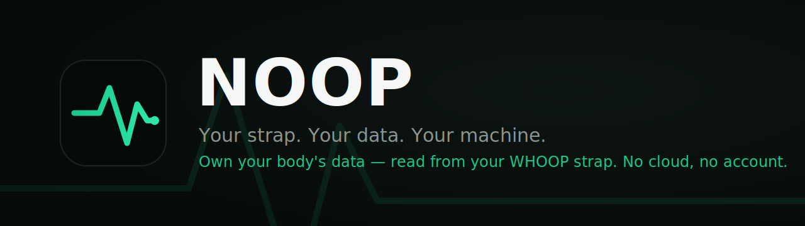

<p align="center">
  
</p>

<h1 align="center">NOOP</h1>

<p align="center"><b>A local-first iOS/macOS app that reads a WHOOP strap over Bluetooth and computes recovery, strain, and sleep entirely on-device.</b></p>

<p align="center">
  
  
  
  
  
  
</p>

---

> **About this README.** This is a personal engineering project I built to own and read my own biometric data. I'm sharing it as a portfolio piece, so this document is written for an engineer reading the code: it leads with the architecture and the hard problems I solved. If you want the user-facing product overview instead, see [`docs/FEATURES.md`](docs/FEATURES.md).

## What it is

I own a WHOOP strap. WHOOP locks the data it collects behind a cloud account and a subscription. NOOP is my answer to that: a native **SwiftUI app** (iOS + macOS from one codebase) that pairs with the strap directly over **Bluetooth LE**, decodes its wire protocol, offloads the on-device history, and computes recovery / strain / sleep locally in **SQLite** — no account, no server, no network.

It's ~34k lines of Swift across **five platform-pure packages** and a thin per-platform app shell, with **359 tests** across the protocol, storage, and analytics layers.

## Highlights (what I'd point a reviewer at)

- **Reverse-engineered BLE offload engine** — a pipelined historical-data transfer that acks each chunk fire-and-forget while persisting off the critical path, with dual (acked / durable) cursors so a crash mid-transfer never loses or double-counts data. → [`Packages/WhoopProtocol/Sources/WhoopProtocol/OffloadEngine.swift`](Packages/WhoopProtocol/Sources/WhoopProtocol/OffloadEngine.swift)
- **Live device lifecycle over CoreBluetooth** — bonding, deferred characteristic subscription, clock sync, a continuous-drain backfill scheduler, and self-healing reconnect for a device that streams a ~2 Hz raw flood the whole time. → [`Strand/BLE/BLEManager.swift`](Strand/BLE/BLEManager.swift)
- **On-device analytics** — HRV (RMSSD/SDNN with ectopic filtering), a personal-baseline recovery score, log-scale strain, and a gravity+HR **sleep stager** — all pure, tested, and grounded in published methods. → [`Packages/StrandAnalytics/`](Packages/StrandAnalytics/)
- **Two device generations, one decoder** — a schema-driven frame parser handling WHOOP 4.0 (CRC8) and WHOOP 5.0/MG (CRC16-Modbus "puffin" framing) behind a single `DeviceFamily` seam. → [`Packages/WhoopProtocol/`](Packages/WhoopProtocol/)

## Architecture

Logic lives in platform-pure Swift packages (no UI-framework or CoreBluetooth imports), so it runs unchanged in tests and CLI tools. The app targets are thin shells over them; framework-specific UI is guarded with `#if canImport(UIKit)` / `#if canImport(AppKit)`.

```
Strand/                  SwiftUI app (iOS + macOS from one source tree)
Packages/
  WhoopProtocol/         BLE frame parsing, CRC8/CRC16/CRC32, packet + historical-stream decode
  WhoopStore/            GRDB/SQLite persistence — versioned migrations, streams, metric caches
  StrandAnalytics/       HRV / recovery / strain / sleep / correlation math (pure, no DB)
  StrandImport/          WHOOP CSV + streaming Apple Health (SAX) importers
  StrandDesign/          SwiftUI design system — palette, components, charts
Tools/Backfill/          CLI for backfilling/decoding without the app
```

```
WHOOP strap ──BLE──▶ Strand/BLE + Strand/Collect ──▶ WhoopProtocol (decode)
                                                          │
WHOOP CSV  ─┐                                             ▼
Apple Health├─▶ StrandImport (parse) ───────────▶ WhoopStore (local SQLite)
 export.xml ─┘                                            │
                                                          ▼
                                          StrandAnalytics (recovery/strain/HRV/sleep)
                                                          │
                                                          ▼
                                          Strand (SwiftUI) + StrandDesign
```

Every arrow stays on-device.

## Engineering problems I solved

A few that show the kind of work in here:

**1. Pipelined, crash-safe BLE offload.**
The strap sends its stored history in chunks and stalls until each chunk is acknowledged. The naïve loop acks *after* the disk write, as a confirmed (round-trip) BLE write — so every chunk paid `disk latency + radio round-trip` of dead air. I decoupled the ack from persistence: snapshot the chunk in memory, ack immediately and *unconfirmed*, and persist off the critical path, so the strap streams chunk N+1 while chunk N is still being written. Two cursors keep it safe — `ackedTrim` (told to the device, keeps it flowing) and `durableTrim` (only advanced once the write lands) — so a crash between ack and disk re-pulls exactly the un-persisted chunk, never losing or duplicating data. The engine is CoreBluetooth-free and unit-tested against a mock transport.

**2. Making the sync actually continuous.**
Overnight syncs were stalling at ~16%. The transfer engine was fast; the *scheduling* wasn't — each session drained for ~60 s then sat idle 15 minutes. I added a bounded auto-continue: a productive session that ends on the idle watchdog (not on a clean "complete") re-kicks immediately, draining the device back-to-back until it's genuinely caught up, guarded so a wedged device can't hot-loop. Paired with faster reconnect and a keep-alive path that the WHOOP-5 family was silently missing.

**3. Honest correctness in the analytics.**
The strap's day boundaries were being bucketed in UTC while the imported history used local time, so computed strain landed a day off. I moved day bucketing to the local calendar and gave strain its own local-midnight-to-midnight window (separate from the sleep-detection window), so activity is attributed to the day it actually happened. Sleep was computed but never displayed — the view only understood a legacy stage format; I fixed the decoder to read the real segment timeline and render the true hypnogram.

**4. A sync gauge that tells the truth.**
"Live" originally meant "newest sample is recent" — which reads green even with a week of holes behind it, because live HR keeps the frontier fresh. I made it the product of two honest signals: **freshness** (how caught-up to now) × **wear-completeness** (fraction of *worn* hours actually pulled, so off-wrist gaps never count against you). It only reads full when you're genuinely current *and* complete.

## Tech stack

- **Swift 5.9**, **SwiftUI** across iOS 16 / macOS 13 from a single source tree
- **CoreBluetooth** — central role: scan, bond, service/characteristic discovery, notify subscriptions, confirmed + unconfirmed writes, background state restoration
- **GRDB.swift / SQLite** — versioned schema migrations, typed reads, cursors, a raw-frame outbox
- **Swift Concurrency** — `async/await`, `@MainActor` isolation (Swift-6-mode clean across 28 files)
- **XcodeGen** — the Xcode project is generated from [`project.yml`](project.yml)
- Only two third-party dependencies: **GRDB.swift** (SQLite) and **ZIPFoundation** (export unzip). All parsing, framing, CRCs, and analytics are hand-written.

## Build & run

**Requirements:** macOS 13+, Xcode 15+ (Swift 5.9). To pair live you need your own WHOOP strap; to just explore the UI, import a WHOOP CSV or Apple Health export.

```bash
git clone https://github.com/mitchellfgibson/apollo-hacked NOOP
cd NOOP
brew install xcodegen        # if needed
xcodegen generate            # builds Strand.xcodeproj from project.yml
open Strand.xcodeproj         # Strand scheme → Run (⌘R)
```

The packages also build and test on their own, no app project required:

```bash
cd Packages/WhoopProtocol && swift build && swift test
```

## Package tour

| Package | Responsibility | Notable |
|---|---|---|
| **WhoopProtocol** | On-wire BLE decode | Schema-driven parser, CRC8 / CRC16-Modbus / CRC32, frame reassembly, the crash-safe `OffloadEngine`. Platform-pure (no CoreBluetooth) so it's fully unit-testable. |
| **WhoopStore** | Local persistence | GRDB/SQLite with a versioned migrator; decoded-stream tables (HR, R-R, SpO₂, skin temp, resp, gravity), metric caches, cursors, raw outbox. |
| **StrandAnalytics** | On-device math | `HRVAnalyzer` (Task Force 1996 RMSSD/SDNN + Malik filtering), `RecoveryScorer`, `StrainScorer` (Karvonen %HRR / Banister TRIMP), `SleepStager`, `CorrelationEngine`. Pure and database-free. |
| **StrandImport** | Bring-your-own history | Tolerant WHOOP CSV parser; a **streaming** SAX parser for multi-GB Apple Health `export.xml` with dedupe + unit normalization. |
| **StrandDesign** | SwiftUI design system | Palette, typography, motion, and reusable charts (`RecoveryRing`, `Hypnogram`, `Sparkline`, `TrendChart`, …) — no external UI deps. |

## What builds on prior work, and what's mine

This project stands on open reverse-engineering of the WHOOP BLE protocol, and I want to be precise about the line:

- The **WHOOP 4.0 protocol** decoding and early collection logic are adapted from **`johnmiddleton12/my-whoop`**.
- The **WHOOP 5.0 / MG** framing (the `fd4b0001` service family, CRC16-Modbus header, "puffin" packet types) is ported from **`b-nnett/goose`**.

**What I designed and built on top:** the pipelined crash-safe offload engine and its cursor model; the full CoreBluetooth device lifecycle (bonding, deferred subscription, continuous-drain scheduling, self-healing reconnect); the WHOOP-5 historical decode + persistence path; the on-device sleep-computation pipeline and its wiring into the app; the analytics correctness work (local-day bucketing, day-windowed strain, the freshness×completeness sync metric); the entire SwiftUI app and design system; and the test suites across the packages.

Contains no WHOOP proprietary code, firmware, logos, or assets, and performs no DRM circumvention. Full credits in [`ATTRIBUTION.md`](ATTRIBUTION.md).

## Disclaimer

Independent, unofficial, non-commercial interoperability project — **not affiliated with, endorsed by, or connected to WHOOP, Inc.** "WHOOP" is used nominatively, only to name the hardware this talks to. **Not a medical device**; every derived metric is an approximation, not clinical data. Provided as-is. See [`DISCLAIMER.md`](DISCLAIMER.md).

## More docs

- [`docs/FEATURES.md`](docs/FEATURES.md) — the user-facing feature tour (screens, automations)
- [`docs/PROTOCOL.md`](docs/PROTOCOL.md) — the BLE protocol in depth
- [`docs/ARCHITECTURE.md`](docs/ARCHITECTURE.md) · [`docs/DATA_MODEL.md`](docs/DATA_MODEL.md) · [`docs/ANALYTICS.md`](docs/ANALYTICS.md)
- [`ATTRIBUTION.md`](ATTRIBUTION.md) — full credits · [`DISCLAIMER.md`](DISCLAIMER.md) — legal notice
